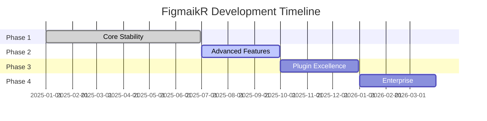

# FigmaikR Development Roadmap 🗺️

## 📋 Project Overview

FigmaikR is a comprehensive design system toolkit that bridges the gap between design and code with seamless Tailwind CSS integration. This roadmap outlines our development priorities and future enhancements across all packages.

## 🎯 Current Status (Q2 2025)

### ✅ Completed Features
- **cssma Core**: Bidirectional CSS ↔ Figma conversion
- **cssma-react**: React hooks and components
- **cssma-plugin**: Figma plugin with real-time conversion
- **figmai-landing**: Marketing website
- **Class-names Parser System**: 16 specialized parsers
- **CSS Converter System**: Full CSS generation capability
- **Runtime Optimization**: 36% CSS size reduction

## 🚀 Development Phases

### Phase 1: Core Stability & Performance (Q1-Q2 2025) ✅
**Status: Completed**

#### cssma Package
- [x] Complete class-names parser system (16 parsers)
- [x] CSS converter with property mapping
- [x] Figma variable support
- [x] Runtime optimization system
- [x] Comprehensive test coverage (600+ tests)

#### cssma-react Package  
- [x] useCssma hook
- [x] useCssmaMultiple hook (array & object support)
- [x] useCssmaRuntime hook
- [x] NodeRenderer component with cssOptions

### Phase 2: Advanced Features & Integrations (Q3 2025) 🔄
**Status: In Progress**

#### cssma Package Enhancements
- [ ] **Animation System**
  - [ ] CSS animations to Figma transitions
  - [ ] Keyframe animation support
  - [ ] Easing function mapping
  - [ ] Timeline-based animations

- [ ] **Advanced Layout Systems**
  - [ ] CSS Grid advanced features
  - [ ] Container queries support
  - [ ] Subgrid implementation
  - [ ] Flexbox gap improvements

- [ ] **Design Token Integration**
  - [ ] Design tokens JSON import/export
  - [ ] Token validation system
  - [ ] Multi-brand token support
  - [ ] Token documentation generator

#### cssma-react Package Enhancements
- [ ] **Component Library**
  - [ ] Pre-built design system components
  - [ ] Theme provider integration
  - [ ] Dark mode support
  - [ ] Responsive component variants

- [ ] **Developer Tools**
  - [ ] React DevTools integration
  - [ ] Style debugging tools
  - [ ] Performance monitoring
  - [ ] Hot reload optimization

### Phase 3: Plugin & Tooling Excellence (Q3-Q4 2025) 📋
**Status: Planning**

#### cssma-plugin Enhancements
- [ ] **AI-Powered Features**
  - [ ] Smart style suggestions
  - [ ] Design pattern recognition
  - [ ] Accessibility recommendations
  - [ ] Code quality analysis

- [ ] **Collaboration Features**
  - [ ] Team style libraries
  - [ ] Version control integration
  - [ ] Comment and review system
  - [ ] Real-time collaboration

- [ ] **Advanced Export Options**
  - [ ] Multiple framework support (Vue, Angular, Svelte)
  - [ ] Component library generation
  - [ ] Storybook integration
  - [ ] Design system documentation

#### figmai-landing Enhancements
- [ ] **Interactive Demos**
  - [ ] Live code playground
  - [ ] Interactive tutorials
  - [ ] Feature showcase
  - [ ] Performance benchmarks

- [ ] **Community Features**
  - [ ] User showcase gallery
  - [ ] Template marketplace
  - [ ] Community plugins
  - [ ] Success stories

### Phase 4: Ecosystem & Enterprise (Q4 2025-Q1 2026) 🏢
**Status: Future Planning**

#### Enterprise Features
- [ ] **Enterprise Plugin**
  - [ ] SSO integration
  - [ ] Advanced permissions
  - [ ] Audit logging
  - [ ] Custom branding

- [ ] **API & Integrations**
  - [ ] REST API for automation
  - [ ] Webhook support
  - [ ] CI/CD integrations
  - [ ] Third-party tool connectors

#### New Packages
- [ ] **cssma-cli**
  - [ ] Command-line interface
  - [ ] Batch processing
  - [ ] Build tool integration
  - [ ] Migration utilities

- [ ] **cssma-vscode**
  - [ ] VS Code extension
  - [ ] IntelliSense support
  - [ ] Live preview
  - [ ] Debugging tools

## 📊 Priority Matrix

### High Priority (Next 3 months)
1. **Animation System** - High demand feature
2. **Component Library** - Developer productivity
3. **AI-Powered Features** - Competitive advantage
4. **Performance Optimization** - User experience

### Medium Priority (3-6 months)
1. **Design Token Integration** - Enterprise readiness
2. **Advanced Export Options** - Market expansion
3. **Collaboration Features** - Team workflows
4. **CLI Tools** - Developer tooling

### Low Priority (6+ months)
1. **Enterprise Features** - Specific market segment
2. **VS Code Extension** - Nice-to-have
3. **API Integrations** - Advanced use cases
4. **Community Marketplace** - Long-term growth

## 🎯 Success Metrics

### Technical Metrics
- **Performance**: <100ms conversion time
- **Coverage**: 95%+ Tailwind CSS support
- **Quality**: <1% bug rate in production
- **Compatibility**: Support for Figma API updates within 1 week

### Business Metrics
- **Adoption**: 10K+ plugin installs
- **Engagement**: 70%+ monthly active users
- **Satisfaction**: 4.5+ star rating
- **Community**: 1K+ GitHub stars

## 🛠️ Technical Debt & Maintenance

### Ongoing Maintenance
- [ ] **Dependency Updates**
  - [ ] Regular security updates
  - [ ] Performance improvements
  - [ ] API compatibility

- [ ] **Code Quality**
  - [ ] Refactoring legacy code
  - [ ] Improving test coverage
  - [ ] Documentation updates
  - [ ] Performance profiling

### Infrastructure
- [ ] **CI/CD Improvements**
  - [ ] Automated testing pipeline
  - [ ] Performance regression testing
  - [ ] Security scanning
  - [ ] Deployment automation

## 🤝 Community & Contributions

### Open Source Strategy
- [ ] **Contributor Onboarding**
  - [ ] Contribution guidelines
  - [ ] Good first issues
  - [ ] Mentorship program
  - [ ] Recognition system

- [ ] **Community Building**
  - [ ] Discord/Slack community
  - [ ] Regular office hours
  - [ ] Community challenges
  - [ ] User feedback sessions

## 📅 Timeline Summary

## 🔄 Review & Updates

This roadmap is reviewed and updated monthly based on:
- User feedback and feature requests
- Market trends and competitive analysis
- Technical feasibility assessments
- Resource availability and team capacity

**Last Updated**: June 2025  
**Next Review**: July 2025

---

*This roadmap is a living document and subject to change based on user needs, technical constraints, and business priorities.* 